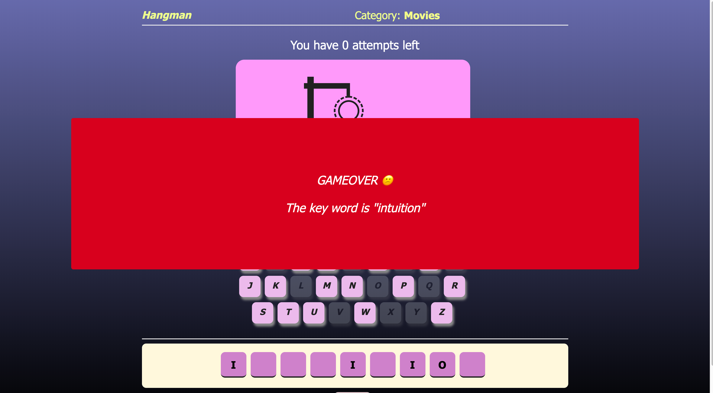

# Hangman Game 

## Project Description:

Hangman is a game in which player guess letters to spell a word in a given category. Players can gives 8 wrong attempts to guess the right word befor the man will be hanged. After all the words have been correctly spelled, the winner will be determined.

## Motivation: 

This javascript game was created as a means of practicing and learning javascript. I learned the value and almost necessity of psuedocoding prior to even defining a variable when it comes to scripting the business logic of a website, or game in this instance.

## Find the game here (Link):

To play the game immediately: https://happy-curran-a46978.netlify.app/

## Wireframe:

## Game play:

## Structure

To do the game, we will need four different data structures to play the game. This structures are the following:

- Words. An array with some words. We will take a random word from this array, and it will be the word that the player will have to figure out.
- Errors left. Number of errors that the user can make until the end of the game.
- Secret word. This will be an string to store the word selected randomly.
- Letters. Another array, in this case just for letters. 

## Technologies used:

- Visual Studio Code: used for coding with Html, CSS, and JavaScript
- wireframe.cc: used for building the wireframe
- Google Chrome Web Browser: used for launching the website
- Google Chrome Developer Tools: used to debug and solve problems in the code.

## Things to Do (Future plans):
1. Add more categories.
2. Add a better hangman figure
3. Make Hangman creator